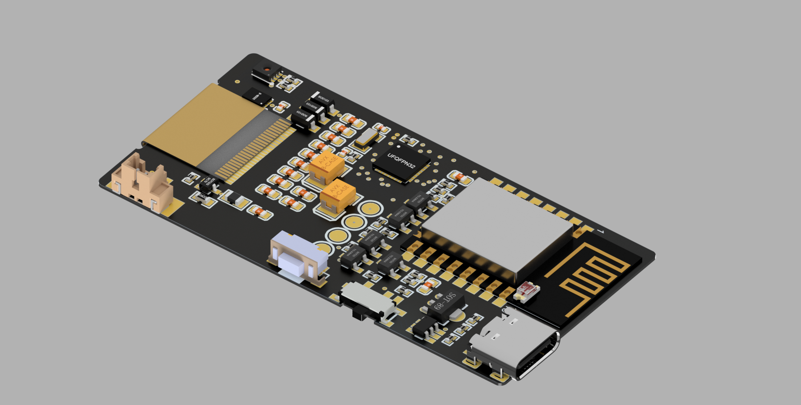
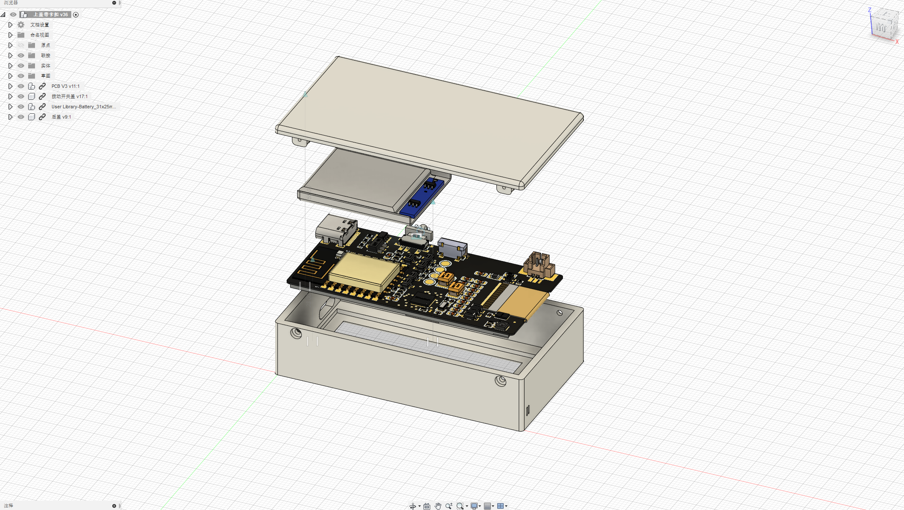
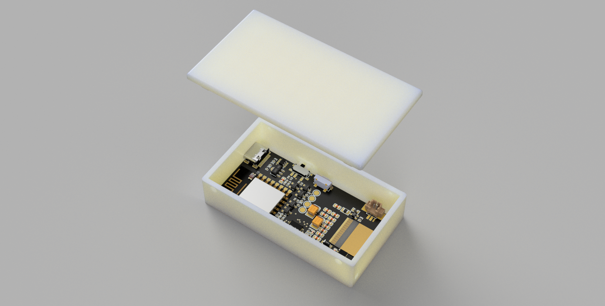

# EPD_clock

# 前言

​	本作品使用的是涂鸦智能MCU SDK进行开发，MCU使用的是ST家的STM32L051K8U6~~还好这颗MCU现在价格还能接受,模组的话考虑到做低功耗则使用的是ZigBee模组,屏幕使用的是HINK的2.13寸墨水屏(微雪家2.13寸黑白同款),当然这个作品必要得有涂鸦智能网关才能使用。

# 元件选型

| 功能 | 型号 |
| --- | --- |
| 单片机 | STM32L051K8U6 |
| 温湿度传感器 | SHT30 |
| ZigBee模组 | TYZS3 |
| LDO | HT7333 |
| 充电芯片 | TP4057 |
| SPI Flash | MX25L1006EZUI |
| 墨水屏 | E0213A04 |

# 基本功能

1. 时间显示，每分钟刷新(24小时自动联网校时)
2. 温湿度显示，半小时刷新并且上报云端
3. 可通过涂鸦智能平台实现设备自动化和断网自动化
4. 可通过涂鸦智能平台实现OTA功能

# 成品效果

# 低功耗

​	这个作品大部分时间都花在扣功耗上，使用了4颗PMOS分别控制SPI FLASH、墨水屏、模组和电池电压测量电路。在不需要使用对应的器件时，关断电源减少不必要的功耗。
​	MCU通过RTC闹钟唤醒，初始化SPI和必要的GPIO并且刷新屏幕更新时间，当更新完成MCU将GPIO设置为模拟输入，减少不必要的功耗。目前休眠电流能压在平均35ua左右(模组长通电情况下)。

  当然这个电流还能压，如果控制模组电源则休眠电流能压到2.7-3ua。(LDO静态电流+SHT30+MCU休眠电流)

# 外壳

​	外壳使用的是fusion 360进行绘制的，PCB模型因为现在立创EDA暂时还不能导出step的文件模型，所以这里临时采用Altium Designer进行导出。
稍微渲染一下的效果

有了PCB模型画外壳就事半功倍了，至少不用卡尺量PCB。
外壳成品图

渲染一下的效果

实体装配后

# 作品演示

[https://www.bilibili.com/video/BV1Pz4y117Rv](https://www.bilibili.com/video/BV1Pz4y117Rv)

# 立创EDA
[https://lceda.cn/hqs1/epd_clock](https://lceda.cn/hqs1/epd_clock)

# 后期玩法

本作品PCB是兼容涂鸦智能WIFI模组，可以焊WIFI模组移植涂鸦WIFI MCU SDK在该PCB上使用，并且可实现天气显示在墨水屏。**有任何商用，或牟利想法的，请离开！！！开源不是白嫖。请自主学习，共同成长。**

# 支持作者
​	点个Star吧,呜呜呜